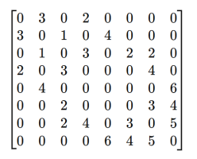
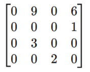
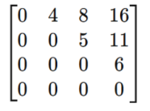
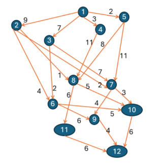

# Práctica 6

`data/distances.csv` contiene la lista de adyacencias de la gráfica dirigida del ejercicio 4.

## Integrantes

- Alba Pérez Paulina
- Galeana Morán Miguel Ángel
- Herrera Barrera Joyce

## Uso e instalación

Para ejecutar el codigo es necesario instalar a través de la terminal:

- `matplotlib`
- `import numpy as np` 
- `from math import inf`

Ejecutar el codigo de la siguiente manera:
- `data.py`: Contiene todas las funciones creadoras de matrices.
- `dijkstra.py`: Contiene algoritmo de dijkstra y lo necesario para la solución a cada ejercicio.
- `main.py`: Contiene el código para ejecutar cada uno de los 4 ejercicios.

## Ejercicio 1
Programar una función que reciba la matriz de pesos de una gráfica y el nodo inicial y que
aplique el algoritmo de Dijkstra. La función debe regresar una lista con las distancias de las
rutas y el origen de la arista con la que terminó la ruta.

## Ejercicio 2
Usar las listas generadas por la función del algoritmo de Dijkstra, programar
una función que encuentre el camino óptimo entre dos vértices.

## Ejercicio 3
Probar las funciones con las siguientes matrices de pesos, empezando siempre en el nodo 0.

Nota : Donde se encuentre un cero quiere decir que no existe una arista entre dichos vertices.

La matriz de pesos está dada por:

*Gráfica 1*

Otra gráfica dirigida:

*Gráfica 2*

Otra matriz de pesos está dada por:

*Gráfica 3*

## Ejercicio 4
Encontrar la distancia mínima para el siguiente ejemplo , y organizar el diagrama para tenerlo en
Python.

*Ejemplo*
## Conclusión

¿Te gustó la programación dinámica? ¿Sientes que te será útil? ¿Se te hace una buena estrategia para la resolución de problemas?
